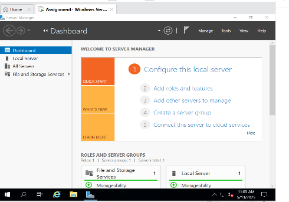
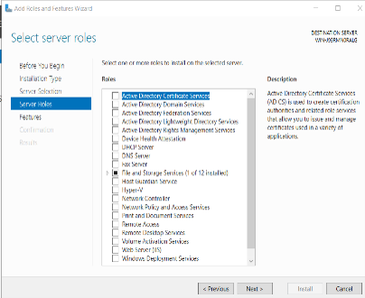
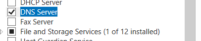
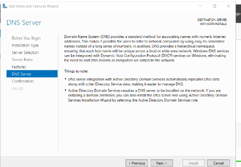
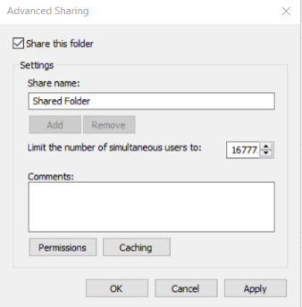
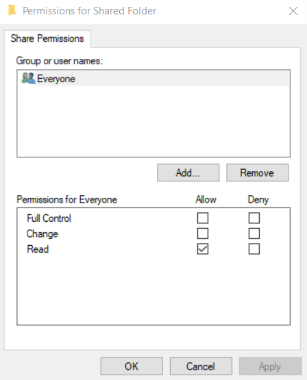
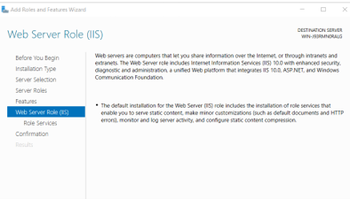
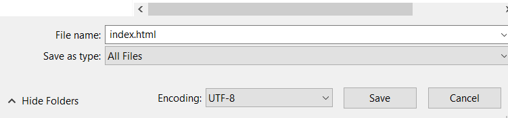
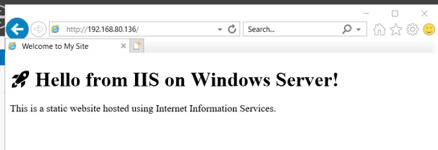
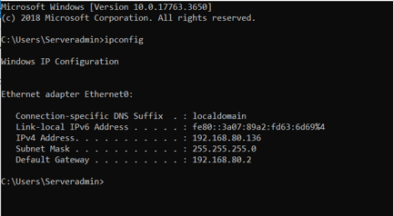

# Windows Server 2022 Lab

I previously used VMware Workstation to set up a Windows Server 2022 virtual machine as part of a university practical project.

I used the lab to practise server configuration, networking, file sharing, web hosting and basic security.

## Virtual Machine Setup

The Windows Server virtual machine was configured with:

- 2 virtual CPUs
- 4 GB RAM
- 40 GB virtual hard disk
- Windows Server 2022
- VMware Workstation
- NAT networking

I configured the server and connected it to a NAT network so it could access the internet for updates and downloads.

## DNS

I installed the DNS Server role through Server Manager and created a Forward Lookup Zone.






I then used `nslookup` to test whether DNS was resolving names correctly.

```cmd
nslookup

This helped me understand how DNS works and how I could check a DNS issue from the command line.

File Sharing

I created a shared folder called SharedFiles and configured its permissions.

The folder was set up so users could read the files without having permission to edit or delete them.

This gave me experience with basic file sharing and access permissions on Windows Server.



IIS Web Server

I installed Internet Information Services (IIS) through Server Manager.



I then created an index.html file in:


C:\inetpub\wwwroot

I accessed the server using its IP address from the host machine and confirmed that the webpage loaded successfully.


This gave me some practical experience with installing a server role, configuring a basic website and testing connectivity.



Windows Server Security

I also worked with several Windows security features.

Windows Defender Firewall

I configured firewall rules to control which services could communicate with the server.

Group Policy

I used Group Policy Management to practise applying security settings and password policies.

I also created a separate lower-privilege user account rather than using the main administrator account for general use.

BitLocker

I configured BitLocker on the server's system drive and worked through the requirements needed to enable encryption in the virtual machine.

Problems I Encountered

The lab wasn't completely straightforward and I had to troubleshoot several problems.

One issue involved XAMPP services failing to start. I checked the error messages and investigated possible port conflicts and permission problems before trying different configuration changes.

I also had a networking problem when configuring a static IP on the Linux VM. I checked the IP information and reviewed the network configuration before correcting the settings to match the VMware NAT network.

Another problem occurred when trying to enable BitLocker because the virtual machine did not have a compatible TPM. I researched the issue and changed the relevant Group Policy setting so that BitLocker could be enabled in the lab environment.

What I Learned

The main thing I took from this lab was the importance of troubleshooting step by step.

Rather than immediately changing settings, I learned to:

Understand what the problem is
Check the error or symptoms
Look at relevant settings or logs
Try a reasonable fix
Test whether the fix worked
Record what I changed

This is the approach I would use when investigating issues in an IT support environment.


