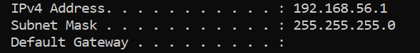

# Network Troubleshooting

I used my own Windows laptop to practise some basic network troubleshooting.

## If a user couldn't connect

The first things I'd check are:

- Are they connected to Wi-Fi or Ethernet?
- Is it just them or are other people affected?
- When did the problem start?
- Are they getting an error?
- Can they access any websites?

## Checking the network information

I used `ipconfig` to see the IP address, subnet mask and default gateway on my laptop.



## Testing the connection

I used `ping` to test whether my laptop could reach an external IP address.

```cmd
ping 8.8.8.8
