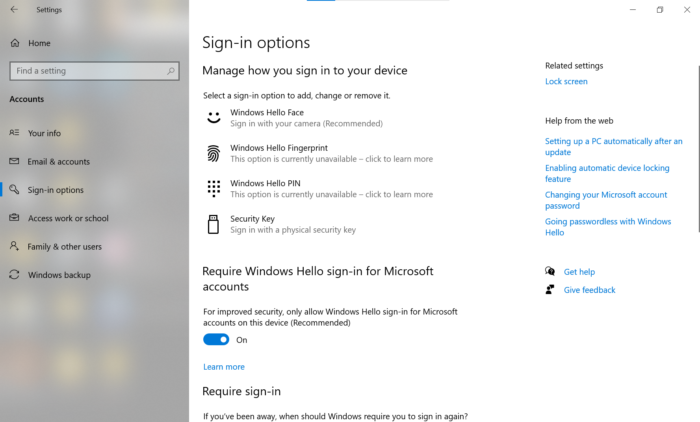
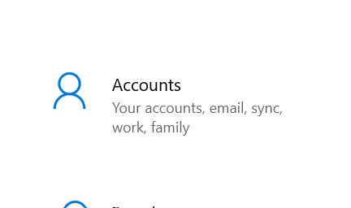

# Password and Account Troubleshooting

## Scenario

A user reports that they cannot access their account.

## Initial Investigation

I would first establish:

- What error message is displayed?
- When did the issue begin?
- Is the problem affecting only one user?
- Has the password recently been changed?
- Can the user access other systems?

## Checking Account Settings

I reviewed the Windows account settings to understand where account and sign-in options are located.

## Security Considerations

I would never ask a user to provide their password.

Before performing an account or password reset, I would follow the organisation's approved identity verification procedure.

## Escalation

If the issue required permissions or access beyond first-line support, I would document the investigation and escalate it according to the organisation's procedures.