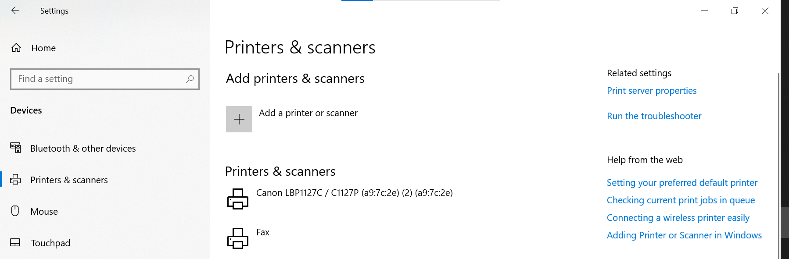

# Printer Troubleshooting

## Scenario

A user reports that they cannot print a document.

## Initial Questions

I would establish:

- Which printer are they trying to use?
- Is the printer showing as available?
- Is the issue affecting only one user?
- Can other users print?
- Is there an error message?
- Is the printer connected to the network?

## Checking Installed Printers

I reviewed the Windows printer settings to understand how installed printers and their status can be checked.

## Initial Troubleshooting

I would check:

1. Whether the correct printer is selected.
2. Whether the printer is online.
3. Whether there are documents stuck in the print queue.
4. Whether the computer can communicate with the printer.
5. Whether restarting the print application or printer resolves the issue.

## Escalation

If the problem appeared to be related to the wider network, printer hardware or infrastructure, I would document the checks completed and escalate appropriately.