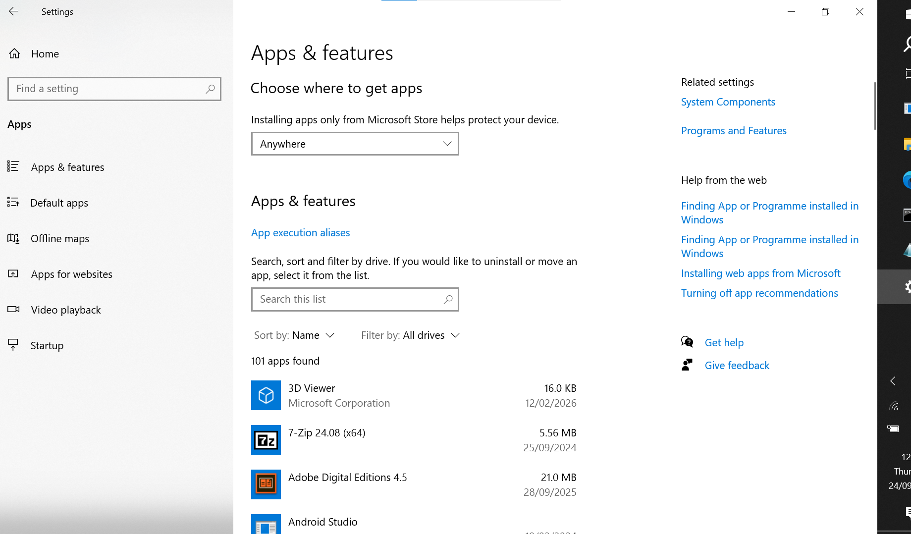
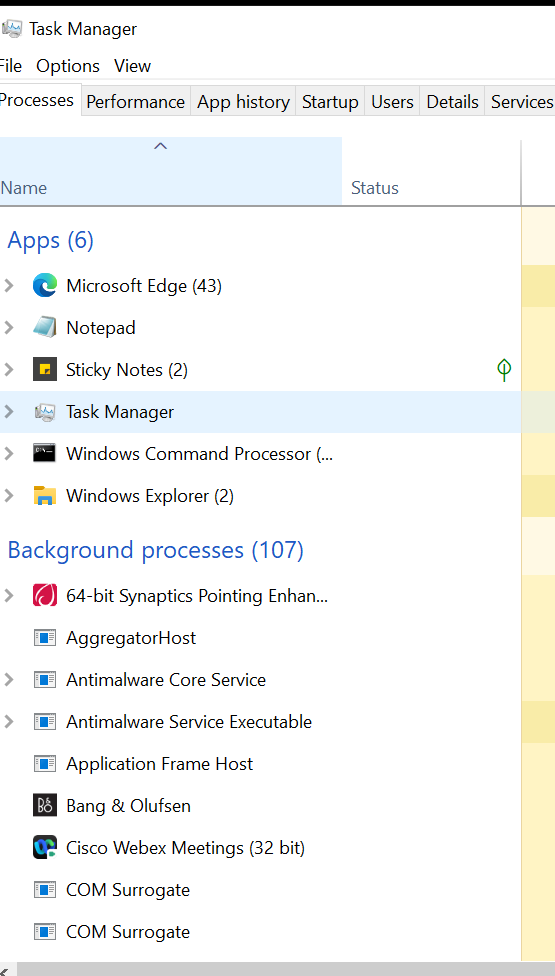

# Software and Application Troubleshooting

## Scenario

A user reports that an application is not opening or has stopped responding.

## Initial Questions

I would establish:

- Which application is affected?
- What happens when the user opens it?
- Is there an error message?
- When did the issue start?
- Was the application previously working?
- Are other users experiencing the same issue?

## Checking Installed Applications

I reviewed Windows installed applications to understand where software can be identified and managed.

## Checking Running Applications

I used Task Manager to understand where running applications and processes can be reviewed.

## Troubleshooting Approach

I would:

1. Record the error message.
2. Check whether the application is running.
3. Close and reopen the application.
4. Restart the computer if appropriate.
5. Check for available updates.
6. Check organisational knowledge articles.
7. Reinstall or repair the application only if this is permitted by support procedures.

## Escalation

If the problem cannot be resolved through first-line procedures, I would document the troubleshooting completed and escalate it to the appropriate team.